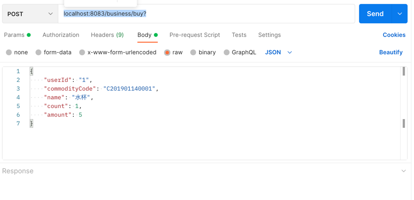
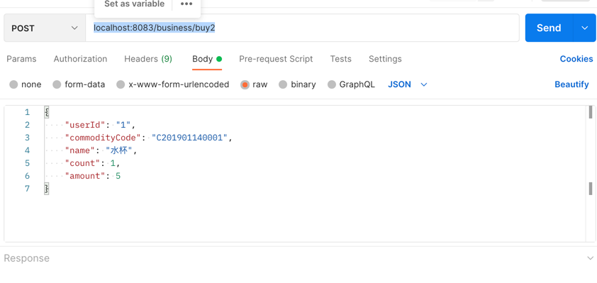
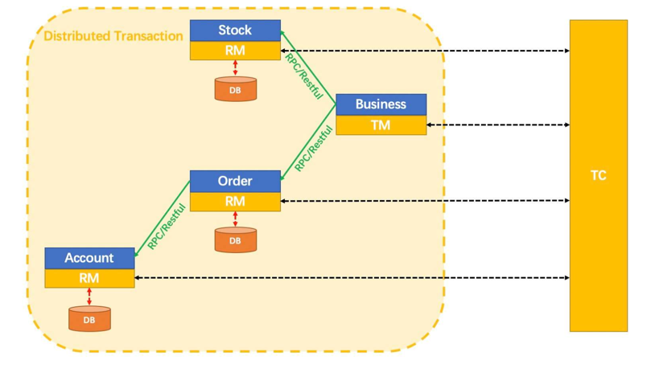

# springcloud-nacos-seata

**分布式事务组件seata的使用demo，AT模式，集成nacos、springboot、springcloud、mybatis-plus，数据库采用mysql**

demo中使用的相关版本号，具体请看代码。如果搭建个人demo不成功，验证是否是由版本导致，由于目前这几个项目更新比较频繁，版本稍有变化便会出现许多奇怪问题

* seata 1.4.2
* spring-cloud-alibaba-seata 2.2.7.RELEASE
* spring-cloud-starter-alibaba-nacos-discovery 2.2.7.RELEASE
* springboot 2.3.12.RELEASE
* springcloud Hoxton.SR2

----------

## 1. 服务端配置

### 1.1 Nacos-server

版本为nacos-server-2.0.0，demo采用本地单机部署方式，请参考 [Nacos 快速开始](https://nacos.io/zh-cn/docs/quick-start.html)

### 1.2 Seata-server

seata-server为release版本1.4.2，demo采用本地单机部署，从此处下载 [https://github.com/seata/seata/releases](https://github.com/seata/seata/releases)
并解压

#### 1.2.1 修改conf/registry.conf 配置

设置type、设置serverAddr为你的nacos节点地址。

**注意这里有一个坑，serverAddr不能带‘http://’前缀**

~~~properties
registry {
   type = "nacos"
   
   nacos {
      application = "seata-server"
      serverAddr = "law.internal.gridsumdissector.com:30076"
      group = "SEATA_GROUP"
      namespace = "seata-test"
      cluster = "default"
      username = "nacos"
      password = "nacos"
   }
}

config {
   type = "nacos"
   
   nacos {
      serverAddr = "law.internal.gridsumdissector.com:30076"
      namespace = "seata-test"
      group = "SEATA_GROUP"
      username = "nacos"
      password = "nacos"
      dataId = "seataServer.properties"
   }
}

~~~

#### 1.2.2 修改conf/nacos-config.txt 配置

service.vgroupMapping.${your-service-gruop}=default，中间的${your-service-gruop}为自己定义的服务组名称，服务中的bootstrap.yaml文件里配置服务组名称。

demo中有四个服务，分别是business-service, account-service, stock-service和order-service，所以配置如下

~~~properties
service.vgroupMapping.business-service-group=default
service.vgroupMapping.account-service-group=default
service.vgroupMapping.stock-service-group=default
service.vgroupMapping.order-service-group=default
~~~

** 注意：
1.在1.4.2版本后nacos的远程配置已经合并到一个文件了，seataServer.properties，但是有个BUG，client读取不到上述配置，还必须再单独分开配上面的四个服务；
2.这里order-service-group 不能以"_"定义，例如：order_service_group，否则读不到（解析BUG）。 

**

#### 1.3 启动seata-server

**分两步，如下**

~~~shell
# 初始化seata 的nacos配置
cd ${seata-server}/conf
sh nacos-config.sh ${nacos ip}

# 启动seata-server
cd bin
sh seata-server.sh
~~~

----------

## 2. 应用配置

### 2.1 数据库初始化

~~~SQL
DROP DATABASE IF EXISTS seata_account;
CREATE DATABASE seata_account;
USE seata_account;

DROP TABLE IF EXISTS `account_tbl`;
CREATE TABLE `account_tbl` (
 `id` int(11) NOT NULL AUTO_INCREMENT,
 `user_id` varchar(255) DEFAULT NULL,
 `amount` double(14,2) DEFAULT '0.00',
  PRIMARY KEY (`id`)
) ENGINE=InnoDB AUTO_INCREMENT=2 DEFAULT CHARSET=utf8;

-- 
----------------------
-- Records of t_account
-- ----------------------------
INSERT INTO `t_account` VALUES ('1', '1', '4000.00');

-- 创建 order库、业务表、undo_log表
create database seata_order;
use seata_order;

DROP TABLE IF EXISTS `order_tbl`;
CREATE TABLE `order_tbl` (
 `id` int(11) NOT NULL AUTO_INCREMENT,
 `order_no` varchar(255) DEFAULT NULL,
 `user_id` varchar(255) DEFAULT NULL,
 `commodity_code` varchar(255) DEFAULT NULL,
 `count` int(11) DEFAULT '0',
 `amount` double(14,2) DEFAULT '0.00',
  PRIMARY KEY (`id`)
) ENGINE=InnoDB DEFAULT CHARSET=utf8;

CREATE TABLE `undo_log`
(
  `id`            BIGINT(20)   NOT NULL AUTO_INCREMENT,
  `branch_id`     BIGINT(20)   NOT NULL,
  `xid`           VARCHAR(100) NOT NULL,
  `context`       VARCHAR(128) NOT NULL,
  `rollback_info` LONGBLOB     NOT NULL,
  `log_status`    INT(11)      NOT NULL,
  `log_created`   DATETIME     NOT NULL,
  `log_modified`  DATETIME     NOT NULL,
  `ext`           VARCHAR(100) DEFAULT NULL,
  PRIMARY KEY (`id`),
  UNIQUE KEY `ux_undo_log` (`xid`, `branch_id`)
) ENGINE = InnoDB
  AUTO_INCREMENT = 1
  DEFAULT CHARSET = utf8;

-- 创建 stock库、业务表、undo_log表
create database seata_stock;
use seata_stock;

DROP TABLE IF EXISTS `stock_tbl`;
CREATE TABLE `stock_tbl` (
  `id` int(11) NOT NULL AUTO_INCREMENT,
  `commodity_code` varchar(255) DEFAULT NULL,
  `name` varchar(255) DEFAULT NULL,
  `count` int(11) DEFAULT '0',
  PRIMARY KEY (`id`),
  UNIQUE KEY `commodity_code` (`commodity_code`)
) ENGINE=InnoDB AUTO_INCREMENT=2 DEFAULT CHARSET=utf8;

CREATE TABLE `undo_log`
(
  `id`            BIGINT(20)   NOT NULL AUTO_INCREMENT,
  `branch_id`     BIGINT(20)   NOT NULL,
  `xid`           VARCHAR(100) NOT NULL,
  `context`       VARCHAR(128) NOT NULL,
  `rollback_info` LONGBLOB     NOT NULL,
  `log_status`    INT(11)      NOT NULL,
  `log_created`   DATETIME     NOT NULL,
  `log_modified`  DATETIME     NOT NULL,
  `ext`           VARCHAR(100) DEFAULT NULL,
  PRIMARY KEY (`id`),
  UNIQUE KEY `ux_undo_log` (`xid`, `branch_id`)
) ENGINE = InnoDB
  AUTO_INCREMENT = 1
  DEFAULT CHARSET = utf8;

-- 初始化库存模拟数据
INSERT INTO `stock_tbl` VALUES ('1', 'C201901140001', '水杯', '1000');
~~~

### 2.2 应用配置

见代码

几个重要的配置

1. 每个应用的resource里需要配置一个registry.conf ，demo中与seata-server里的配置相同
2. application.yaml 的各个配置项，注意spring.cloud.alibaba.seata.tx-service-group 是服务组名称，与nacos-config.txt
   配置的service.vgroupMapping.${your-service-gruop}具有对应关系

----------

## 3. 测试

1. 分布式事务成功，模拟扣款、下单、扣库存
   localhost:8083/business/buy

2. 分布式事务失败，模拟扣款成功、下单成功、扣库存失败，最终同时回滚
   localhost:8083/business/buy2

## 4. 业务架构

   

